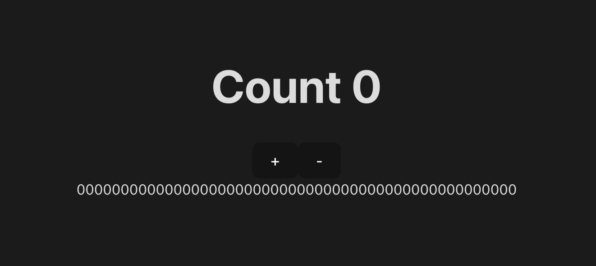
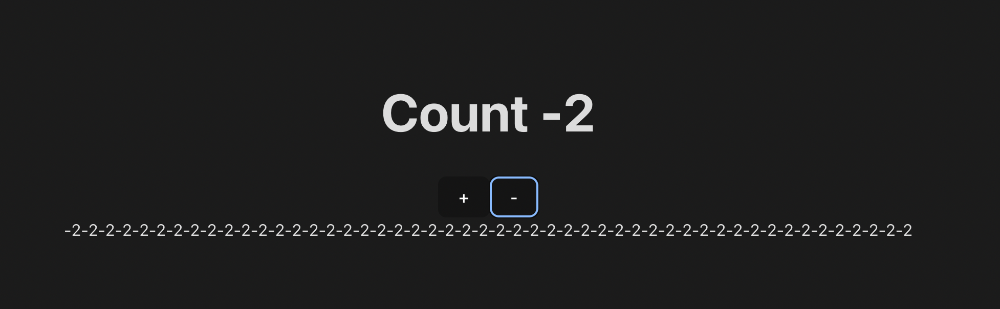
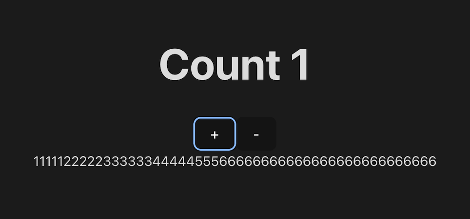

# tearing-problem-react18

Tearing 問題についての自分用のメモです。

## 目的

先日、Zustand と呼ばれる状態管理ライブラリを使用していたのですが、ふと、「Zustand ってどのようなコードで書かれているのだろうか」と疑問に思ったところ、過去のバージョンである 3.1.0 では useRef を利用し、必要な場合には useReducer を使用して強制的に再レンダリングを走らせていました(バージョン 3.1.0 時点の src フォルダ配下の index.ts ファイル内の 79 行目からの useEffect の処理を見ると確認できると思います)。しかし、最新のバージョンでは useRef を利用し、必要に応じて useReducer で強制的に再レンダリングを走らせるということは無くなっていました。代わりに[use-sync-external-store](https://www.npmjs.com/package/use-sync-external-store)というものを利用したものになっていました。そのことを疑問に思って色々調べてみて、最終的にその変更は Tearing 問題によるものだという結論に至りました。このレポジトリはその結果をまとめたものになります。

## Tearing 問題について

なぜ useRef と useReducer によって再レンダリングを走らせるのをやめたか、それを説明するには Tearing 問題を説明しなければいけないようです。Tearing 問題とは Reactjs のバージョン 18 以降に組み込まれた並列レンダラ(concurrent renderer)によって起きた問題です。
その問題とは startTransition のような同時実行機能を使用する場合、React は一時停止して他の作業を行うことができてしまうことで、レンダリングに使用されるデータを変更する更新が起こってしまい、同じデータに対して 2 つの異なる値が UI に表示される可能性があるというものでした。要するに、Zustand などの外部ストアを使って、同じ状態を複数表示している際、同じ状態を参照しているはずなのに異なる値が表示されてしまう可能性があったということです(もちろん、既に Zustand や React-Redux は既にこの問題に対応済みです)。
この問題を説明した Github の Discussions があるので貼っておきます。[こちらのサイトです](https://github.com/reactwg/react-18/discussions/69)

といっても、上記の説明では中々わからないと思います。

そのため、この問題を可視化できるよう、簡単なデモをこのレポジトリで作りました。

## 作成したデモ

Tearing 問題に対応する前の Zustand(バージョン 3.1.0)を使って、以下の src フォルダ配下の useStore.jsx ファイルに以下の Store を作成しました。Count を増やしたり、減らしたりできる Counter アプリを作成するための Store です

```
import create from "zustand";

const useStore = create((set) => ({
  count: 0,
  increase: () => {
    set((state) => ({ count: state.count + 1 }));
  },
  decrease: () => {
    set((state) => ({ count: state.count - 1 }));
  },
}));

export default useStore;
```

そして、同じく src フォルダ配下に DisplayCount.jsx というファイルを作りました。
名前の通り、store 内の count を表示するだけのコンポーネントです

```
import useStore from "./useStore";

const DisplayCount = () => {
  const count = useStore((state) => state.count);
  // 以下の2行のコードにより、重い計算を再現しています。こうした方がTearing問題が起きやすいので
  const start = performance.now();
  while (performance.now() - start < 20) {}

  return (
    <>
      {count}
    </>
  );
};

export default DisplayCount;
```

最後に、src フォルダ配下の App.jsx です。主に以下のことをしています。

1. store 内で定義した count と increase 関数、decrease 関数を import する
2. increase 関数のみ startTransition で囲む
3. 先程の DisplayCount コンポーネントを 50 個呼び出す

```
import { startTransition } from "react";
import useStore from "./useStore";
import DisplayCount from "./DisplayCount";
import "./App.css";

const App = () => {
  // 1. storeからstateを呼び出している
  const count = useStore((state) => state.count);
  const increaseCount = useStore((state) => state.increase);
  const decreaseCount = useStore((state) => state.decrease);

  // 2. startTransitionでincreaseCount関数を囲む
  const transitionInc = () => {
    startTransition(() => {
      increaseCount();
    });
  };

  return (
    <>
      <h1>Count {count}</h1>
      <div>
        <button onClick={transitionInc}>+</button>
        <button onClick={decreaseCount}>-</button>
      </div>
      {/* 3. DisplayCountコンポーネントを50個呼び出す */}
      {[...Array(50).keys()].map((key) => (
        <DisplayCount key={key} />
      ))}
    </>
  );
};

export default App;
```

もちろん、DisplayCount コンポーネントには

```
const start = performance.now();
  while (performance.now() - start < 20) {}
```
この記述があり、それが書かれているコンポーネントを50個呼び出しているので、処理は重くなっています。


この状態で、ひとまずstartTransitionに囲んでいないdecreaseCount関数をAppコンポーネントの「-」ボタンを押して呼び出してみます。もちろん、短い間隔で「-」ボタンを何度押しても一斉に数値が変わります。



一方でstartTransitionで囲んだincreaseCount関数を、短い間隔で何度も「+」ボタンを押して呼び出してみましょう。今回は短い間隔で6回「+」ボタンを押してみました


上記の画像を見ると、1から6までの数値がバラバラに表示されていることがわかるでしょうか。
同じ状態を参照しているはずなのに異なる値が表示されてしまっています。この現象を「Tearing」問題と呼んでいるのだと思います。

この問題を解決するために、[use-sync-external-store](https://www.npmjs.com/package/use-sync-external-store)というものを利用しているのです。
